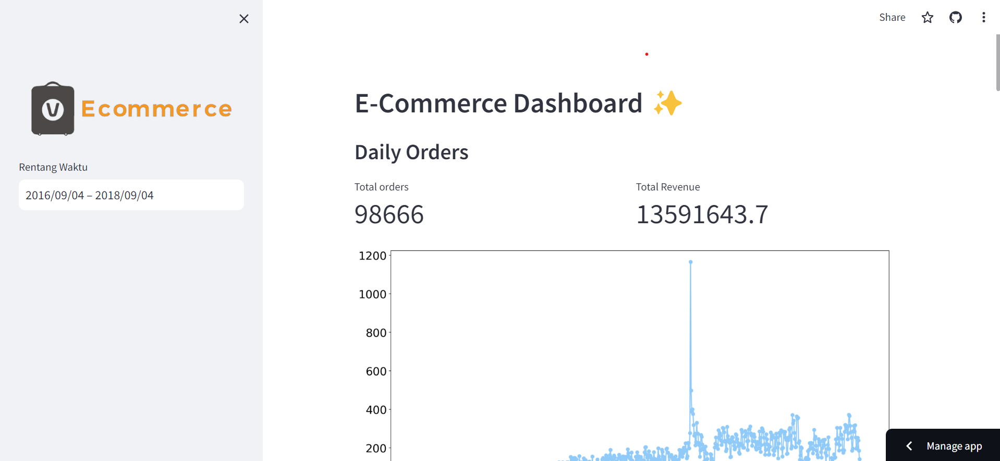

# E-Commerce Dashboard✨

## Setup environment
```
conda create --name main-ds python=3.9
conda activate main-ds
pip install numpy pandas scipy matplotlib seaborn jupyter streamlit babel
```

## Run steamlit app
```
streamlit run dashboard.py
```

## Online Demo
[https://nftn9gnt2c36g8uv6wt7ma.streamlit.app/](https://nftn9gnt2c36g8uv6wt7ma.streamlit.app/)

